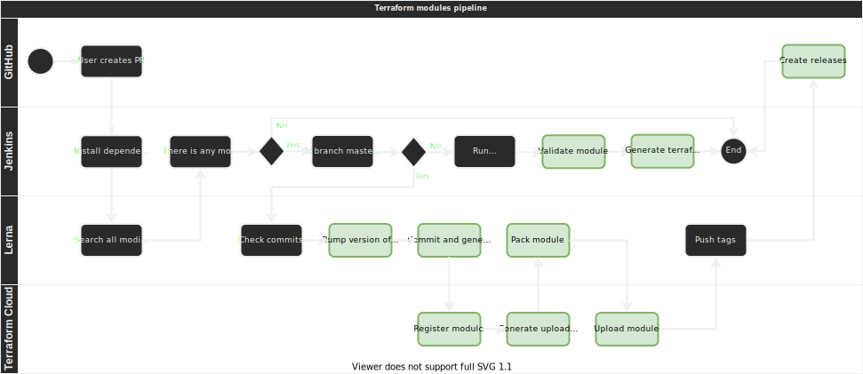

# Terraform Modules

This module complements the ideas of the article:
[How to use Lerna in a monorepo to deploy Terraform modules](soon).

Monorepo with all our Terraform modules, with specific versioning to everyone of
them. The modules stay in our [Terraform Cloud private repository](https://app.terraform.io/app/igorbrites/registry/private/modules).

## Modules

All modules stays in [`modules`](modules) folder, separated by its main
provider. E.g.:

```bash
└── modules
    ├── aws
    │   └── rds
    │       ├── CHANGELOG.md
    │       ├── LICENSE
    │       ├── README.md
    │       ├── main.tf
    │       ├── outputs.tf
    │       ├── package.json
    │       └── variables.tf
    └── common
        └── labels
            ├── CHANGELOG.md
            ├── LICENSE
            ├── README.md
            ├── main.tf
            ├── outputs.tf
            ├── package.json
            └── variables.tf
```

As you can see, all modules follows this format:

- `main.tf`: Main file with the principal codes. If the module does a lot of
  things, is a good idea to split in different files, but you can put main calls
  here;
- `outputs.tf` and `variables.tf`: The files to store input and output variables.
  You must leave these files in the folder, even if they are empty (more on this
  later);
- `README.md`: Here you document everything that the module does, with the
  objective of it, examples on how to use the module, etc. Some info will be added
  by [`terraform-docs`](https://terraform-docs.io/) during pipeline (variables,
  outputs, providers...);
- `LICENSE`: The module's license. It will be `Proprietary` in most cases, but
  the file is required by Terraform Cloud;
- `package.json`: Here is how we will controll each version of each module.

These files are required by Terraform Cloud to recognize the module and show its
versions.

## Contributing

### Commits

To make versioning of the modules, we will use [Conventional Commits](https://www.conventionalcommits.org/en/v1.0.0/).
If you are not familiarized, the commits must look like this:

```bash
git commit -m "chore(my-module): explanation of my commit"
```

In this way, depending of commits, we now what will be the next version:

- `fix:` commits creates a new `PATCH` version;
- `feat:` commits creates a new `MINOR` version;
  - There is other commit types, like `build:`, `chore:`, `ci:`, `docs:`, `style:`,
    `refactor:`, `perf:`, `test:`, but they will behave as `feat:`;
- If your modifications breaks the behaviour of the module, you must do a commit
  with a `!` mark after the type (or after the scope), and add a description of
  the breaking change two lines bellow in commit, like this:

  ```bash
  git commit -m "refactor(my-module)!: refactoring the entire module

  BREAKING CHANGE: this module does not support Terraform prior to 1.x anymore."
  ```

  In this way, it creates a new `MAJOR` version.

So, the first step after cloning this repo is running `npm install`.

_"But wait"_ I hear you say, _"this is a Terraform repo, why should I run `npm install`?"_

To ensure all commits will follow the rules above, we use [Husky Hooks](https://typicode.github.io/husky/#/)
and [commitlint](https://github.com/conventional-changelog/commitlint) during
commit. You can see these scripts in [.husky](.husky) folder. And `npm install`
installs the hooks in your local environment.

### Creating a new module

You can run `.scripts/new-module.sh`:


### Tools

This repo requires Terraform 1.x or later. If you don't want to download it or
any other tool used here, you can use [ASDF](https://asdf-vm.com/). It manages
versions of different tools (like nodejs, golang, kubectl...), and you only need
to run `.scripts/asdf.sh`, it will install ASDF and the tools listed in the
[`.tool-versions`](.tool-versions) file.

## CI/CD

Here we use [Jenkins](https://www.jenkins.io/) as our CI/CD tool, and you can
check all pipeline at [`Jenkinsfile`](./Jenkinsfile) file. But the flow is this:

|  |
|:--:|
| _All green boxes are commands executed for each module_ |

- You open a PR with your modifications;
- Jenkins executes `Validation` and `Terraform Docs`;
  - The first runs a series of validations:
    - We use [GitHub's super-linter](https://github.com/github/super-linter),
      which lints everything in the repo: Terraform, Shell scripts, JSON, YAML, etc;
    - Then we run `terraform validate` on each modified module.
  - The other runs [`terraform-docs`](https://github.com/terraform-docs/gh-actions)
    on each modified module, injecting its output on `README.md` and commit this
    modification.
    - To `terraform-docs` work propperly, you need to add some annotations to
      `README.md`: `<!-- BEGIN_TF_DOCS -->` and `<!-- END_TF_DOCS -->`. So in
      Jenkins, `terraform-docs` will generate module's docs and insert between
      these annotations. You can add any information before and after them, but
      anything mannualy wrote between them will be overwritten.

After merging the PR, Jenkins creates the versions of each modified module.
To achive this, we use [Lerna](https://lerna.js.org/), a tool for managing
monorepos with multiple packages. It is used mainly to deal with NodeJS packages,
but the only restriction to Lerna identify a package (module) is to have a `package.json`
inside the package. So, it can see all modifications on that module, and create
versions based on these modifications. Then it creates a tag called like
`module@0.1.2`, puts this version inside `package.json`, creates a `CHANGELOG.md`
of the module, and pushes everything back to GitHub.

Then, after each module has its version, we use
[Terraform Cloud's API](https://www.terraform.io/docs/cloud/api/modules.html) to
push the new module there. In TF Cloud, the module's URL is something like this:

```bash
https://app.terraform.io/app/igorbrites/registry/modules/private/igorbrites/module-name/provider/version

# E.g.: https://app.terraform.io/app/igorbrites/registry/modules/private/igorbrites/labels/commons/2.1.0
```

## Modules usage

E.g.:

```hcl
module "labels" {
  source  = "app.terraform.io/igorbrites/labels/common"
  version = "2.1.0"
  # insert required variables here
}
```
